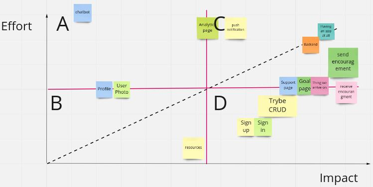
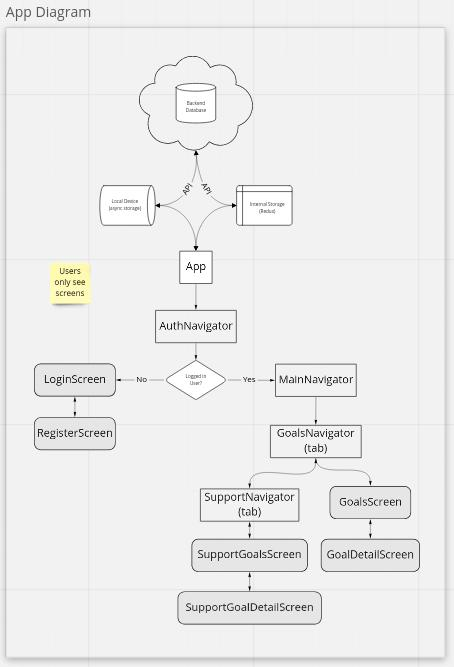

# TRYBE


## Team

[Luiza](https://github.com/LGretzk) <br>
[Kieran](https://github.com/K-Carty) <br>
[George](https://github.com/GeorgeDainton) <br>
[Luke](https://github.com/lukestorey95) <br>
[Gawain](https://github.com/gawainhewitt) <br>

## Introduction

Welcome to Trybe. This is our [Makers Academy](https://makers.tech/) final project which we have built in 8 days. <br>

Trybe is an app that helps to build and manage a community in the supporting of achieving bespoke goals. The idea is a group of friends, your TRYBE (TM) will help motivate you with encouragement, while the app also allows you to track and share progress. We concieved it as a type of inverse to the Strava style of tracking, in that your network is small and private, and goals can range from things you would be proud to share, to things you may want to stay discreet about. 

## Instructions for use of proof of concept

At the point of writing, TRYBE is still in development, and will need to be run via an Expo client app in order to experience it. It will require the full codebase, and confidence with VS Code and terminal. 

Open a terminal in the TrybeFrontend folder, and excecute the following:

In order to run this app you will first need to work on node v 16

```
nvm install 16.15.1
```

Then install expo

```
npm install --global expo-cli
```

Then run 

```
npm install
```

You will now need to download the expo app from App Store or the Google Play Store.

Start the front end 'server'.

```
npm start
```

Lastly you will need to create an `environment.js` file and have the Twilio details in it. 

And use your phone to follow the QR code which will set up the app in Expo. Ensure that both your computer and your phone are on the same wireless network.

You will now be able to use our app!

## Backend

The Trybe backend is built using a Python based web framework called the Django Rest Framework and can be found [here](https://github.com/LGretzk/trybe_backend)

## Design, concept and build

Trybe is built using the Expo Framework, and thereofore also the React Native library. 

We decided to build this using Expo as it allowed us to quickly build an app and make rapid progress without needing to set up an emulator. The Expo App has also allowed us to test cross platform behaviour throughout the project. 

On the front end we have followed a strict Agile methodology, prioritising shipping features above all else. 

Initially we built a very quick proof of concept for MVP which was a single file. Once we hit MVP, we then refactored to a component based model, for better seperation of concerns and to ensure that our code was easy to read, easy to change, and modular and therefore easy to reuse when appropriate. 

## Testing

### Decision to not test

Initially we intended to follow a TDD process. In building the MVP, it became clear that learning a new technology while also test driving was not possible if we wanted to make rapid progress. Following MVP we had to make a choice whether to learn to test in React and Expo, or to keep pushing towards features. We decided as a team to push forward for features, and consequently the front end is not tested at all. 

### Consequences of not testing

Maintaining visibility of whether our code is working, and what the consequences of changes to the code base are has been at times a challenge, and we can see that testing would have been a real help at that point. We are also committed as a team to continuing this project beyond the course, and will, at some point, introduce testing which will not necessarily be straightforward. Another way of putting this is we have chosen early gains, and perhaps traded it for pain later. 

## Impact Effort Assessment



## Wireframe


## App structure diagram



## Video of app working 

[](https://www.youtube.com/watch?v=qts_DSZA9IA "Trybe Video")


